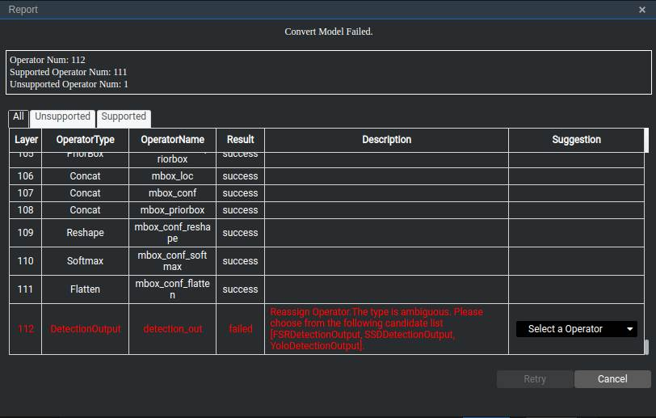

EN|[CN](README_cn.md)

# People Detection<a name="EN-US_TOPIC_0167609412"></a>

Developers can deploy the application on the Atlas 200 DK or the AI acceleration cloud server to decode the local MP4 file or RTSP video streams, detect pedestrians, and human faces in video frames, predict their attributes, generate structured information, and send the structured information to the server for storage and display.

## Prerequisites<a name="en-us_topic_0182554628_section137245294533"></a>

Before using an open source application, ensure that:

-   Mind Studio  has been installed.
-   The Atlas 200 DK developer board has been connected to  Mind Studio, the cross compiler has been installed, the SD card has been prepared, and basic information has been configured.

## Software Preparation<a name="en-us_topic_0182554628_section8534138124114"></a>

Before running the application, obtain the source code package and configure the environment as follows.

1.  <a name="en-us_topic_0182554628_li953280133816"></a>Obtain the source code package.

    Download all the code in the sample-videoanalysisperson repository at  [https://github.com/Ascend/sample-videoanalysisperson](https://github.com/Ascend/sample-videoanalysisperson)  to any directory on Ubuntu Server where  Mind Studio  is located as the  Mind Studio  installation user, for example,  _/home/ascend/sample-videoanalysisperson_.

2.  <a name="en-us_topic_0182554628_li5507119145914"></a>Obtain the source network model required by the application.

    Obtain the source network model and its weight file used in the application by referring to  [Table 1](#en-us_topic_0182554628_table1193115345597), and save them to any directory on the Ubuntu server where  Mind Studio  is located (for example,  **$HOME/ascend/models/videoanalysispersion**).

    **Table  1**  Models used in the people detection application

    <a name="en-us_topic_0182554628_table1193115345597"></a>
    <table><thead align="left"><tr id="en-us_topic_0182554628_row1187103505916"><th class="cellrowborder" valign="top" width="15.17%" id="mcps1.2.4.1.1"><p id="en-us_topic_0182554628_p887235105910"><a name="en-us_topic_0182554628_p887235105910"></a><a name="en-us_topic_0182554628_p887235105910"></a>Model Name</p>
    </th>
    <th class="cellrowborder" valign="top" width="10.47%" id="mcps1.2.4.1.2"><p id="en-us_topic_0182554628_p16877355598"><a name="en-us_topic_0182554628_p16877355598"></a><a name="en-us_topic_0182554628_p16877355598"></a>Model Description</p>
    </th>
    <th class="cellrowborder" valign="top" width="74.36%" id="mcps1.2.4.1.3"><p id="en-us_topic_0182554628_p18713511598"><a name="en-us_topic_0182554628_p18713511598"></a><a name="en-us_topic_0182554628_p18713511598"></a>Model Download Path</p>
    </th>
    </tr>
    </thead>
    <tbody><tr id="en-us_topic_0182554628_row3881635175910"><td class="cellrowborder" valign="top" width="15.17%" headers="mcps1.2.4.1.1 "><p id="en-us_topic_0182554628_p48863512592"><a name="en-us_topic_0182554628_p48863512592"></a><a name="en-us_topic_0182554628_p48863512592"></a>face_detection</p>
    </td>
    <td class="cellrowborder" valign="top" width="10.47%" headers="mcps1.2.4.1.2 "><p id="en-us_topic_0182554628_p1541603617318"><a name="en-us_topic_0182554628_p1541603617318"></a><a name="en-us_topic_0182554628_p1541603617318"></a>Network model for face detection.</p>
    <p id="en-us_topic_0182554628_p18531438317"><a name="en-us_topic_0182554628_p18531438317"></a><a name="en-us_topic_0182554628_p18531438317"></a>It is a network model converted from ResNet0-SSD300 model based on Caffe.</p>
    </td>
    <td class="cellrowborder" valign="top" width="74.36%" headers="mcps1.2.4.1.3 "><p id="en-us_topic_0182554628_p1588203519592"><a name="en-us_topic_0182554628_p1588203519592"></a><a name="en-us_topic_0182554628_p1588203519592"></a>Download the source network model file and its weight file by referring to<strong id="en-us_topic_0182554628_b820812515127"><a name="en-us_topic_0182554628_b820812515127"></a><a name="en-us_topic_0182554628_b820812515127"></a> README.md</strong> in <a href="https://github.com/Ascend/models/tree/master/computer_vision/object_detect/face_detection" target="_blank" rel="noopener noreferrer">https://github.com/Ascend/models/tree/master/computer_vision/object_detect/face_detection</a>.</p>
    </td>
    </tr>
    <tr id="en-us_topic_0182554628_row98823585915"><td class="cellrowborder" valign="top" width="15.17%" headers="mcps1.2.4.1.1 "><p id="en-us_topic_0182554628_p1188103555919"><a name="en-us_topic_0182554628_p1188103555919"></a><a name="en-us_topic_0182554628_p1188103555919"></a>pedestrian</p>
    </td>
    <td class="cellrowborder" valign="top" width="10.47%" headers="mcps1.2.4.1.2 "><p id="en-us_topic_0182554628_p18889356598"><a name="en-us_topic_0182554628_p18889356598"></a><a name="en-us_topic_0182554628_p18889356598"></a>Network model for performing inference on human body features.</p>
    <p id="en-us_topic_0182554628_p123011321411"><a name="en-us_topic_0182554628_p123011321411"></a><a name="en-us_topic_0182554628_p123011321411"></a>It is a VeSPA model based on Caffe.</p>
    </td>
    <td class="cellrowborder" valign="top" width="74.36%" headers="mcps1.2.4.1.3 "><p id="en-us_topic_0182554628_p5881335145918"><a name="en-us_topic_0182554628_p5881335145918"></a><a name="en-us_topic_0182554628_p5881335145918"></a>Download the source network model file and its weight file by referring to<strong id="en-us_topic_0182554628_b92101751151219"><a name="en-us_topic_0182554628_b92101751151219"></a><a name="en-us_topic_0182554628_b92101751151219"></a> README.md</strong> in <a href="https://github.com/Ascend/models/tree/master/computer_vision/classification/pedestrian" target="_blank" rel="noopener noreferrer">https://github.com/Ascend/models/tree/master/computer_vision/classification/pedestrian</a>.</p>
    </td>
    </tr>
    <tr id="en-us_topic_0182554628_row388153512593"><td class="cellrowborder" valign="top" width="15.17%" headers="mcps1.2.4.1.1 "><p id="en-us_topic_0182554628_p188811350596"><a name="en-us_topic_0182554628_p188811350596"></a><a name="en-us_topic_0182554628_p188811350596"></a>inception_age</p>
    </td>
    <td class="cellrowborder" valign="top" width="10.47%" headers="mcps1.2.4.1.2 "><p id="en-us_topic_0182554628_p138803555914"><a name="en-us_topic_0182554628_p138803555914"></a><a name="en-us_topic_0182554628_p138803555914"></a>Network model for identifying the age.</p>
    <p id="en-us_topic_0182554628_p147610201340"><a name="en-us_topic_0182554628_p147610201340"></a><a name="en-us_topic_0182554628_p147610201340"></a>It is an Inception V3 model based on TensorFlow.</p>
    </td>
    <td class="cellrowborder" valign="top" width="74.36%" headers="mcps1.2.4.1.3 "><p id="en-us_topic_0182554628_p78813518594"><a name="en-us_topic_0182554628_p78813518594"></a><a name="en-us_topic_0182554628_p78813518594"></a>Download the PB model file of the source network by referring to <strong id="en-us_topic_0182554628_b221210512126"><a name="en-us_topic_0182554628_b221210512126"></a><a name="en-us_topic_0182554628_b221210512126"></a>README.md</strong> in <a href="https://github.com/Ascend/models/tree/master/computer_vision/classification/inception_age" target="_blank" rel="noopener noreferrer">https://github.com/Ascend/models/tree/master/computer_vision/classification/inception_age</a>.</p>
    </td>
    </tr>
    <tr id="en-us_topic_0182554628_row1788163525912"><td class="cellrowborder" valign="top" width="15.17%" headers="mcps1.2.4.1.1 "><p id="en-us_topic_0182554628_p1788123518593"><a name="en-us_topic_0182554628_p1788123518593"></a><a name="en-us_topic_0182554628_p1788123518593"></a>inception_gender</p>
    </td>
    <td class="cellrowborder" valign="top" width="10.47%" headers="mcps1.2.4.1.2 "><p id="en-us_topic_0182554628_p10884353596"><a name="en-us_topic_0182554628_p10884353596"></a><a name="en-us_topic_0182554628_p10884353596"></a>Network model for identifying the gender.</p>
    <p id="en-us_topic_0182554628_p1039303917418"><a name="en-us_topic_0182554628_p1039303917418"></a><a name="en-us_topic_0182554628_p1039303917418"></a>It is an Inception V3 model based on TensorFlow.</p>
    </td>
    <td class="cellrowborder" valign="top" width="74.36%" headers="mcps1.2.4.1.3 "><p id="en-us_topic_0182554628_p1988103514599"><a name="en-us_topic_0182554628_p1988103514599"></a><a name="en-us_topic_0182554628_p1988103514599"></a>Download the PB model file of the source network by referring to <strong id="en-us_topic_0182554628_b14213165115124"><a name="en-us_topic_0182554628_b14213165115124"></a><a name="en-us_topic_0182554628_b14213165115124"></a>README.md</strong> in <a href="https://github.com/Ascend/models/tree/master/computer_vision/classification/inception_gender" target="_blank" rel="noopener noreferrer">https://github.com/Ascend/models/tree/master/computer_vision/classification/inception_gender</a>.</p>
    </td>
    </tr>
    <tr id="en-us_topic_0182554628_row19881135115914"><td class="cellrowborder" valign="top" width="15.17%" headers="mcps1.2.4.1.1 "><p id="en-us_topic_0182554628_p13881355593"><a name="en-us_topic_0182554628_p13881355593"></a><a name="en-us_topic_0182554628_p13881355593"></a>vgg_ssd</p>
    </td>
    <td class="cellrowborder" valign="top" width="10.47%" headers="mcps1.2.4.1.2 "><p id="en-us_topic_0182554628_p128819351596"><a name="en-us_topic_0182554628_p128819351596"></a><a name="en-us_topic_0182554628_p128819351596"></a>Network model for object detection.</p>
    <p id="en-us_topic_0182554628_p155398551242"><a name="en-us_topic_0182554628_p155398551242"></a><a name="en-us_topic_0182554628_p155398551242"></a>It is an SSD512 model based on Caffe.</p>
    <p id="en-us_topic_0182554628_p158813355590"><a name="en-us_topic_0182554628_p158813355590"></a><a name="en-us_topic_0182554628_p158813355590"></a></p>
    </td>
    <td class="cellrowborder" valign="top" width="74.36%" headers="mcps1.2.4.1.3 "><p id="en-us_topic_0182554628_p588183595913"><a name="en-us_topic_0182554628_p588183595913"></a><a name="en-us_topic_0182554628_p588183595913"></a>Download the source network model file and its weight file by referring to<strong id="en-us_topic_0182554628_b92153515122"><a name="en-us_topic_0182554628_b92153515122"></a><a name="en-us_topic_0182554628_b92153515122"></a> README.md</strong> in <a href="https://github.com/Ascend/models/tree/master/computer_vision/object_detect/vgg_ssd" target="_blank" rel="noopener noreferrer">https://github.com/Ascend/models/tree/master/computer_vision/object_detect/vgg_ssd</a>.</p>
    </td>
    </tr>
    </tbody>
    </table>

3.  Convert the source network model to a Da Vinci model.
    1.  Choose  **Tool \> Convert Model**  from the main menu of  Mind Studio. The  **Convert Model**  page is displayed.
    2.  On the  **Convert Model**  page, set  **Model File**  and  **Weight File**  to the model file and weight file downloaded in  [2](#en-us_topic_0182554628_li5507119145914), respectively.
        -   Set  **Model Name**  to the model name in  [Table 1](#en-us_topic_0182554628_table1193115345597).
        -   During TensorFlow model conversion, add a column  **input shape**  and fill in the column. The values of  **W**,  **H**, and  **C**  and the input node name can be obtained from the PB model structure diagram in Netron ([https://lutzroeder.github.io/netron/](https://lutzroeder.github.io/netron/)).
        -   For the inception\_age model,  **age\_inference**  processes 10 images at a time. Therefore,  **N**  of  **Input Shape**  must be set to  **10** during conversion.

            **Figure  1**  Inception\_age model conversion configuration<a name="en-us_topic_0182554628_fig13788131615511"></a>  
            

        -   For the inception\_gender model,  **gender\_inference** processes 10 images at a time. Therefore,  **N**  of  **Input Shape**  must be set to  **10** during conversion.

            **Figure  2**  inception\_gender model conversion configuration<a name="en-us_topic_0182554628_fig34317308619"></a>  
            


    3.  Click  **OK**  to start model conversion.

        During the conversion of the face\_detection and vgg\_ssd models, the following error will be reported.

        **Figure  3**  Model conversion error<a name="en-us_topic_0182554628_fig138681281084"></a>  
        

        Select  **SSDDetectionOutput**  from the  **Suggestion**  drop-down list box at the  **DetectionOutput**  layer and click  **Retry**.

        After successful conversion, a .om Da Vinci model is generated in the  **$HOME/tools/che/model-zoo/my-model/xxx**  directory.

4.  Upload the converted .om model file to the  **sample-videoanalysisperson/script**  directory in the source code path in  [1](#en-us_topic_0182554628_li953280133816).
5.  Log in to Ubuntu Server where  Mind Studio  is located as the  Mind Studio  installation user and set the environment variable  **DDK\_HOME**.

    **vim \~/.bashrc**

    Run the following commands to add the environment variables  **DDK\_HOME**  and  **LD\_LIBRARY\_PATH**  to the last line:

    **export DDK\_HOME=/home/XXX/tools/che/ddk/ddk**

    **export LD\_LIBRARY\_PATH=$DDK\_HOME/uihost/lib**

    > **NOTE:**   
    >-   **XXX**  indicates the  Mind Studio  installation user, and  **/home/XXX/tools**  indicates the default installation path of the DDK.  
    >-   If the environment variables have been added, skip this step.  

    Enter  **:wq!**  to save and exit.

    Run the following command for the environment variable to take effect:

    **source \~/.bashrc**


## Deployment<a name="en-us_topic_0182554628_section1759513564117"></a>

1.  Access the root directory where the people detection application code is located as the  Mind Studio  installation user, for example,  _**/home/ascend/sample-videoanalysisperson**_
2.  <a name="en-us_topic_0182554628_li08019112542"></a>Run the deployment script to prepare the project environment, including compiling and deploying the ascenddk public library and configuring Presenter Server. The Presenter Server is used to receive the data sent by the application and display the result through the browser.

    **bash deploy.sh** _host\_ip_ _model\_mode_

    -   _host\_ip_: For the Atlas 200 DK developer board, this parameter indicates the IP address of the developer board. For the AI acceleration cloud server, this parameter indicates the IP address of the host.

    -   _model\_mode_  indicates the deployment mode of the model file. The value can be  **local**  or  **internet**. The default setting is  **internet**.
        -   **local**: If the Ubuntu system where  Mind Studio  is located is not connected to the network, use the local mode. In this case, you need to have downloaded the dependent common code library to the  **sample-videoanalysisperson/script**  directory by referring to  [Downloading Dependent Code Library](#en-us_topic_0182554628_section13807155164319).
        -   **internet**: If the Ubuntu system where  Mind Studio  is located is connected to the network, use the Internet mode. In this case, download the dependent code library online.


    Example command:

    **bash deploy.sh 192.168.1.2 internet**

    -   When the message  **Please choose one to show the presenter in browser \(default: 127.0.0.1\):**  is displayed, enter the IP address used for accessing the Presenter Server service in the browser. Generally, the IP address is the IP address for accessing the  Mind Studio  service.
    -   When the message  **Please input an absolute path to storage video analysis data:**  is displayed, enter the absolute path for storing video analysis data in  Mind Studio. The  Mind Studio  user must have the read and write permissions. If the path does not exist, the script is automatically created.

    Select the IP address used by the browser to access the Presenter Server service in  **Current environment valid ip list**  and enter the path for storing video analysis data, as shown in  [Figure 4](#en-us_topic_0182554628_fig184321447181017).

    **Figure  4**  Project deployment<a name="en-us_topic_0182554628_fig184321447181017"></a>  
    

3.  <a name="en-us_topic_0182554628_li499911453439"></a>Start Presenter Server.

    Run the following command to start the Presenter Server program of the video analysis application in the background:

    **python3 presenterserver/presenter\_server.py --app video\_analysis\_person &**

    > **NOTE:**   
    >**presenter\_server.py**  is located in the  **presenterserver**  directory. You can run the  **python3 presenter\_server.py -h**  or  **python3 presenter\_server.py --help**  command in this directory to view the usage method of  **presenter\_server.py**.  

    [Figure 5](#en-us_topic_0182554628_fig69531305324)  shows that the presenter\_server service is started successfully.

    **Figure  5**  Starting the Presenter Server process<a name="en-us_topic_0182554628_fig69531305324"></a>  
    

    Use the URL shown in the preceding figure to log in to Presenter Server (only the Chrome browser is supported). The IP address is that entered in  [2](#en-us_topic_0182554628_li08019112542)  and the default port number is  **7011**. The following figure indicates that Presenter Server is started successfully.

    **Figure  6**  Home page<a name="en-us_topic_0182554628_fig64391558352"></a>  
    

    The following figure shows the IP address used by the Presenter Server and  Mind Studio  to communicate with the Atlas 200 DK.

    **Figure  7**  Example IP Address<a name="en-us_topic_0182554628_fig1881532172010"></a>  
    

    Where:

    -   The IP address of the Atlas 200 DK developer board is 192.168.1.2 \(connected in USB mode\).
    -   The IP address used by the Presenter Server to communicate with the Atlas 200 DK is in the same network segment as the IP address of the Atlas 200 DK on the UI Host server. For example: 192.168.1.223.
    -   The following is an example of accessing the IP address of the Presenter Server using a browser: 10.10.0.1, because the Presenter Server and  Mind Studio  are deployed on the same server, the IP address is also the IP address for accessing the  Mind Studio  through the browser.

4.  The video structured application can parse local videos and RTSP video streams.
    -   To parse a local video, upload the video file to the Host.

        For example, upload the video file  **person.mp4**  to the  **/home/HwHiAiUser/sample**  directory on the host.

        > **NOTE:**   
        >H.264 and H.265 MP4 files are supported. If an MP4 file needs to be edited, you are advised to use FFmpeg. If a video file is edited by other tools, FFmpeg may fail to parse the file.  

    -   If only RTSP video streams need to be parsed, skip this step.


## Running<a name="en-us_topic_0182554628_section6245151616426"></a>

1.  Run the video analysis application.

    Run the following command in the  **/home/ascend/sample-videoanalysisperson**  directory to start the video analysis application:

    **bash run\_videoanalysispersonapp.sh** _host\_ip_ _presenter\_view\_appname_ _channel1_ _[channel2]_  &

    -   _host\_ip_: For the Atlas 200 DK developer board, this parameter indicates the IP address of the developer board. For the AI acceleration cloud server, this parameter indicates the IP address of the host.
    -   _presenter\_view\_app\_name_: Indicates  **View Name**  displayed on the Presenter Server page, which is user-defined. The value of this parameter must be unique on the Presenter Server page, which contains only case-senstive leters, digits, and underscores(_). The number of characters should be 3-20.
    -   _channel1_: absolute path of a video file on the host, need to add double quotes when there is only a video file. Channel2 can be omitted
    -   _channel2_: URL of an RTSP video stream. need to add double quotes, when there is only RTSP video stream, you need to use " " to occupy channel1

    Example command of video file:

    **bash run\_videoanalysispersonapp.sh 192.168.1.2 video "/home/HwHiAiUser/sample/person.mp4" &**
    
    Example command of RTSP video stream:
    
    **bash run\_videoanalysispersonapp.sh 192.168.1.2 video " "  "rtsp://192.168.2.37:554/cam/realmonitor?channel=1&subtype=0" &**
    
    > **NOTE:**   
    >The current RTSP video stream only supports the rtsp://ip:port/path format. If you need to use other format urls, you need to remove the IsValidRtsp function in video\_decode.cpp, or return true directly, skipping the regular expression matching.

2.  Use the URL that is displayed when you start the Presenter Server service to log in to the Presenter Server website (only the Chrome browser is supported). For details, see  [3](#en-us_topic_0182554628_li499911453439).

    > **NOTE:**   
    >The Presenter Server of the video analysis application supports the display of a maximum of two  _presenter\_view\_app\_name_  at the same time.  

    The navigation tree on the left displays the app name and channel name of the video. The large image of the extracted video frame and the detected target small image are displayed in the middle. After you click the small image, the detailed inference result and score are displayed on the right.

    This application supports human body attribute detection, and facial attribute detection.

    -   Human body attributes include:

        Ages \(ages 16–30, 31–45, 46–60 as well as 61 and above\); Backpack; Carrying other; Casual lower; Casual upper; Formal lower; Hat; Jacket; Jeans; Leather Shoes; Logo; Short hair/Long hair; Male/Female; Messenger Bag; Muffler; No accessory; No carrying; Plaid; Plastic bags; Sandals; Shoes; Shorts; Short Sleeve; Skirt; Sneaker; Stripes; Sunglasses; Trousers; T-shirt; Upper other; V-Neck.

        In the detailed inference result display area on the video analysis interface,  **Age**,  **Male/Female**, and  **Short hair/Long hair**  are mandatory. Other attributes are displayed only when the confidence level is greater than 0.5.

    -   Facial attribute detection supports age and gender identification.


## Follow-up Operations<a name="en-us_topic_0182554628_section1092612277429"></a>

-   **Stopping the Video Structured Analysis Application**

    To stop the video analysis application, perform the following operations:

    Run the following command in the  **sample-videoanalysisperson**  directory as the  Mind Studio  installation user:

    **bash stop\_videoanalysispersonapp.sh** _host\_ip_

    _host\_ip_: For the Atlas 200 DK developer board, this parameter indicates the IP address of the developer board. For the AI acceleration cloud server, this parameter indicates the IP address of the host.

    Example command:

    **bash stop\_videoanalysispersonapp.sh** _192.168.1.2_

-   **Stopping the Presenter Server Service**

    The Presenter Server service is always in the running state after being started. To stop the Presenter Server service of the video structured analysis application, perform the following operations:

    Run the following command to check the process of the Presenter Server service corresponding to the video structured analysis application as the  Mind Studio  installation user:

    **ps -ef | grep presenter | grep video\_analysis\_person**

    ```
    ascend@ascend-HP-ProDesk-600-G4-PCI-MT:~/sample-videoanalysisperson$ ps -ef | grep presenter | grep video_analysis_car 
    ascend 3656 20313 0 15:10 pts/24?? 00:00:00 python3 presenterserver/presenter_server.py --app video_analysis_person
    ```

    In the preceding information,  _3656_  indicates the process ID of the Presenter Server service corresponding to the facial recognition application.

    To stop the service, run the following command:

    **kill -9** _3656_


## Downloading Dependent Code Library<a name="en-us_topic_0182554628_section13807155164319"></a>

Download the dependent software libraries to the  **sample-videoanalysisperson/script**  directory.

**Table  2**  Download the dependent software library

<a name="en-us_topic_0182554628_table127901541102416"></a>
<table><thead align="left"><tr id="en-us_topic_0182554628_row079020418241"><th class="cellrowborder" valign="top" width="33.33333333333333%" id="mcps1.2.4.1.1"><p id="en-us_topic_0182554628_p9790144142419"><a name="en-us_topic_0182554628_p9790144142419"></a><a name="en-us_topic_0182554628_p9790144142419"></a>Module Name</p>
</th>
<th class="cellrowborder" valign="top" width="33.33333333333333%" id="mcps1.2.4.1.2"><p id="en-us_topic_0182554628_p1179014132415"><a name="en-us_topic_0182554628_p1179014132415"></a><a name="en-us_topic_0182554628_p1179014132415"></a>Module Description</p>
</th>
<th class="cellrowborder" valign="top" width="33.33333333333333%" id="mcps1.2.4.1.3"><p id="en-us_topic_0182554628_p979114418241"><a name="en-us_topic_0182554628_p979114418241"></a><a name="en-us_topic_0182554628_p979114418241"></a>Download Address</p>
</th>
</tr>
</thead>
<tbody><tr id="en-us_topic_0182554628_row8791114120243"><td class="cellrowborder" valign="top" width="33.33333333333333%" headers="mcps1.2.4.1.1 "><p id="en-us_topic_0182554628_p17911641112418"><a name="en-us_topic_0182554628_p17911641112418"></a><a name="en-us_topic_0182554628_p17911641112418"></a>EZDVPP</p>
</td>
<td class="cellrowborder" valign="top" width="33.33333333333333%" headers="mcps1.2.4.1.2 "><p id="en-us_topic_0182554628_p479118419241"><a name="en-us_topic_0182554628_p479118419241"></a><a name="en-us_topic_0182554628_p479118419241"></a>Encapsulates the DVPP interface and provides image and video processing capabilities, such as color gamut conversion and image / video conversion</p>
</td>
<td class="cellrowborder" valign="top" width="33.33333333333333%" headers="mcps1.2.4.1.3 "><p id="en-us_topic_0182554628_p779116417244"><a name="en-us_topic_0182554628_p779116417244"></a><a name="en-us_topic_0182554628_p779116417244"></a><a href="https://github.com/Ascend/sdk-ezdvpp" target="_blank" rel="noopener noreferrer">https://github.com/Ascend/sdk-ezdvpp</a></p>
<p id="en-us_topic_0182554628_p27916412242"><a name="en-us_topic_0182554628_p27916412242"></a><a name="en-us_topic_0182554628_p27916412242"></a>After the download, keep the folder name <span class="filepath" id="en-us_topic_0182554628_filepath279134112243"><a name="en-us_topic_0182554628_filepath279134112243"></a><a name="en-us_topic_0182554628_filepath279134112243"></a><b>ezdvpp</b></span>.</p>
</td>
</tr>
<tr id="en-us_topic_0182554628_row17911541182411"><td class="cellrowborder" valign="top" width="33.33333333333333%" headers="mcps1.2.4.1.1 "><p id="en-us_topic_0182554628_p1579113414248"><a name="en-us_topic_0182554628_p1579113414248"></a><a name="en-us_topic_0182554628_p1579113414248"></a>Presenter Agent</p>
</td>
<td class="cellrowborder" valign="top" width="33.33333333333333%" headers="mcps1.2.4.1.2 "><p id="en-us_topic_0182554628_p4791841152418"><a name="en-us_topic_0182554628_p4791841152418"></a><a name="en-us_topic_0182554628_p4791841152418"></a><span>API for interacting with the Presenter Server</span>.</p>
</td>
<td class="cellrowborder" valign="top" width="33.33333333333333%" headers="mcps1.2.4.1.3 "><p id="en-us_topic_0182554628_p279118414246"><a name="en-us_topic_0182554628_p279118414246"></a><a name="en-us_topic_0182554628_p279118414246"></a><a href="https://github.com/Ascend/sdk-presenter/tree/master" target="_blank" rel="noopener noreferrer">https://github.com/Ascend/sdk-presenter/tree/master</a></p>
<p id="en-us_topic_0182554628_p10791104118244"><a name="en-us_topic_0182554628_p10791104118244"></a><a name="en-us_topic_0182554628_p10791104118244"></a>Obtain the presenteragent folder in this path, after the download, keep the folder name <span class="filepath" id="en-us_topic_0182554628_filepath279174117242"><a name="en-us_topic_0182554628_filepath279174117242"></a><a name="en-us_topic_0182554628_filepath279174117242"></a><b>presenteragent</b></span>.</p>
</td>
</tr>
<tr id="en-us_topic_0182554628_row20792134118246"><td class="cellrowborder" valign="top" width="33.33333333333333%" headers="mcps1.2.4.1.1 "><p id="en-us_topic_0182554628_p1279244118245"><a name="en-us_topic_0182554628_p1279244118245"></a><a name="en-us_topic_0182554628_p1279244118245"></a>FFmpeg code</p>
</td>
<td class="cellrowborder" valign="top" width="33.33333333333333%" headers="mcps1.2.4.1.2 "><p id="en-us_topic_0182554628_p379294122413"><a name="en-us_topic_0182554628_p379294122413"></a><a name="en-us_topic_0182554628_p379294122413"></a>The current application uses FFmpeg to decapsulate video files.</p>
</td>
<td class="cellrowborder" valign="top" width="33.33333333333333%" headers="mcps1.2.4.1.3 "><p id="en-us_topic_0182554628_p8792174172417"><a name="en-us_topic_0182554628_p8792174172417"></a><a name="en-us_topic_0182554628_p8792174172417"></a>The URL for downloading the FFmpeg 4.0 code is <a href="https://github.com/FFmpeg/FFmpeg/tree/release/4.0" target="_blank" rel="noopener noreferrer">https://github.com/FFmpeg/FFmpeg/tree/release/4.0</a>.</p>
<p id="en-us_topic_0182554628_p4792041172414"><a name="en-us_topic_0182554628_p4792041172414"></a><a name="en-us_topic_0182554628_p4792041172414"></a>After the download, keep the folder name <span class="filepath" id="en-us_topic_0182554628_filepath0792154172419"><a name="en-us_topic_0182554628_filepath0792154172419"></a><a name="en-us_topic_0182554628_filepath0792154172419"></a><b>ffmpeg.</b></span></p>
</td>
</tr>
<tr id="en-us_topic_0182554628_row1979215418245"><td class="cellrowborder" valign="top" width="33.33333333333333%" headers="mcps1.2.4.1.1 "><p id="en-us_topic_0182554628_p479211416244"><a name="en-us_topic_0182554628_p479211416244"></a><a name="en-us_topic_0182554628_p479211416244"></a>tornado (5.1.0)</p>
<p id="en-us_topic_0182554628_p1179284122410"><a name="en-us_topic_0182554628_p1179284122410"></a><a name="en-us_topic_0182554628_p1179284122410"></a>protobuf (3.5.1)</p>
<p id="en-us_topic_0182554628_p27921141122413"><a name="en-us_topic_0182554628_p27921141122413"></a><a name="en-us_topic_0182554628_p27921141122413"></a>numpy (1.14.2)</p>
</td>
<td class="cellrowborder" valign="top" width="33.33333333333333%" headers="mcps1.2.4.1.2 "><p id="en-us_topic_0182554628_p1879264111248"><a name="en-us_topic_0182554628_p1879264111248"></a><a name="en-us_topic_0182554628_p1879264111248"></a>Python libraries that Presenter Server depends on.</p>
</td>
<td class="cellrowborder" valign="top" width="33.33333333333333%" headers="mcps1.2.4.1.3 "><p id="en-us_topic_0182554628_p079244114249"><a name="en-us_topic_0182554628_p079244114249"></a><a name="en-us_topic_0182554628_p079244114249"></a>You can search for related packages on the Python official website <a href="https://pypi.org/" target="_blank" rel="noopener noreferrer">https://pypi.org/</a> for installation. If you run the pip3 install command to download the file online, you can run the following command to specify the version to be downloaded: <strong id="en-us_topic_0182554628_b107926415246"><a name="en-us_topic_0182554628_b107926415246"></a><a name="en-us_topic_0182554628_b107926415246"></a>pip3 install tornado==5.1.0 -i <em id="en-us_topic_0182554628_i1179214412243"><a name="en-us_topic_0182554628_i1179214412243"></a><a name="en-us_topic_0182554628_i1179214412243"></a>Installation source of the specified library</em> --trusted-host <em id="en-us_topic_0182554628_i2792134122416"><a name="en-us_topic_0182554628_i2792134122416"></a><a name="en-us_topic_0182554628_i2792134122416"></a>Host name of the installation sourc</em>e</strong></p>
</td>
</tr>
</tbody>
</table>

