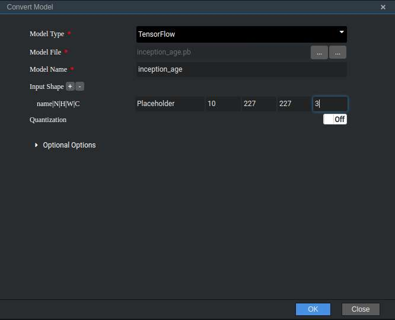
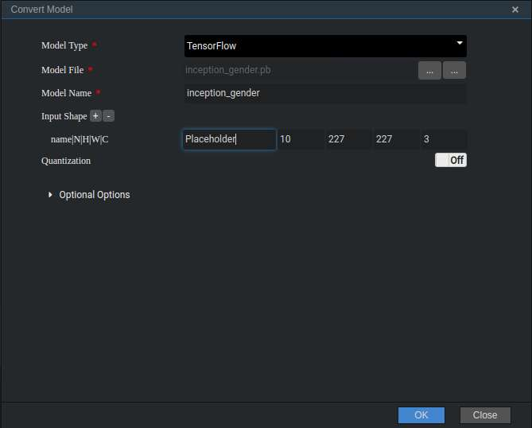
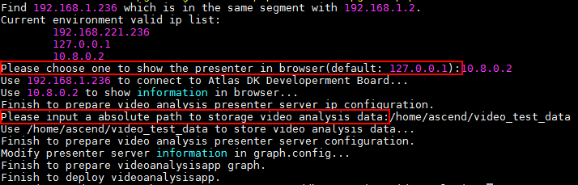
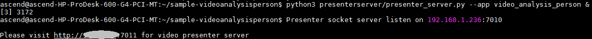

中文|[英文](README.md)

# 人体检测<a name="ZH-CN_TOPIC_0185836251"></a>

开发者将本Application部署至Atlas 200 DK或者AI加速云服务器上实现对本地mp4文件或者RTSP视频流进行解码，对视频帧中的行人和人脸进行检测并对其属性进行预测，生成结构化信息发送至Server端进行保存、展示的功能。

## 前提条件<a name="zh-cn_topic_0182554628_section137245294533"></a>

部署此Sample前，需要准备好以下环境：

-   已完成Mind Studio的安装。
-   已完成Atlas 200 DK开发者板与Mind Studio的连接，交叉编译器的安装，SD卡的制作及基本信息的配置等。

## 软件准备<a name="zh-cn_topic_0182554628_section8534138124114"></a>

运行此Sample前，需要按照此章节获取源码包，并进行相关的环境配置。

1.  <a name="zh-cn_topic_0182554628_li953280133816"></a>获取源码包。

    将[https://github.com/Ascend/sample-videoanalysisperson](https://github.com/Ascend/sample-videoanalysisperson)仓中的代码以Mind Studio安装用户下载至Mind Studio所在Ubuntu服务器的任意目录，例如代码存放路径为：_/home/ascend/sample-videoanalysisperson_。

2.  <a name="zh-cn_topic_0182554628_li5507119145914"></a>获取此应用中所需要的原始网络模型。

    参考[表1](#zh-cn_topic_0182554628_table1193115345597)获取此应用中所用到的原始网络模型及其对应的权重文件，并将其存放到Mind Studio所在Ubuntu服务器的任意目录，例如$HOME/ascend/models/videoanalysispersion。

    **表 1**  人体检测应用中使用模型

    <a name="zh-cn_topic_0182554628_table1193115345597"></a>
    <table><thead align="left"><tr id="zh-cn_topic_0182554628_row1187103505916"><th class="cellrowborder" valign="top" width="15.06%" id="mcps1.2.4.1.1"><p id="zh-cn_topic_0182554628_p887235105910"><a name="zh-cn_topic_0182554628_p887235105910"></a><a name="zh-cn_topic_0182554628_p887235105910"></a>模型名称</p>
    </th>
    <th class="cellrowborder" valign="top" width="10.58%" id="mcps1.2.4.1.2"><p id="zh-cn_topic_0182554628_p16877355598"><a name="zh-cn_topic_0182554628_p16877355598"></a><a name="zh-cn_topic_0182554628_p16877355598"></a>模型说明</p>
    </th>
    <th class="cellrowborder" valign="top" width="74.36%" id="mcps1.2.4.1.3"><p id="zh-cn_topic_0182554628_p18713511598"><a name="zh-cn_topic_0182554628_p18713511598"></a><a name="zh-cn_topic_0182554628_p18713511598"></a>模型下载路径</p>
    </th>
    </tr>
    </thead>
    <tbody><tr id="zh-cn_topic_0182554628_row3881635175910"><td class="cellrowborder" valign="top" width="15.06%" headers="mcps1.2.4.1.1 "><p id="zh-cn_topic_0182554628_p48863512592"><a name="zh-cn_topic_0182554628_p48863512592"></a><a name="zh-cn_topic_0182554628_p48863512592"></a>face_detection</p>
    </td>
    <td class="cellrowborder" valign="top" width="10.58%" headers="mcps1.2.4.1.2 "><p id="zh-cn_topic_0182554628_p688163513595"><a name="zh-cn_topic_0182554628_p688163513595"></a><a name="zh-cn_topic_0182554628_p688163513595"></a>人脸检测网络模型。</p>
    <p id="zh-cn_topic_0182554628_p1488735175914"><a name="zh-cn_topic_0182554628_p1488735175914"></a><a name="zh-cn_topic_0182554628_p1488735175914"></a>此模型是基于Caffe的Resnet10-SSD300模型转换后的网络模型。</p>
    </td>
    <td class="cellrowborder" valign="top" width="74.36%" headers="mcps1.2.4.1.3 "><p id="zh-cn_topic_0182554628_p1588203519592"><a name="zh-cn_topic_0182554628_p1588203519592"></a><a name="zh-cn_topic_0182554628_p1588203519592"></a>请参考<a href="https://github.com/Ascend/models/tree/master/computer_vision/object_detect/face_detection" target="_blank" rel="noopener noreferrer">https://github.com/Ascend/models/tree/master/computer_vision/object_detect/face_detection</a>目录中README.md下载原始网络模型文件及其对应的权重文件。</p>
    </td>
    </tr>
    <tr id="zh-cn_topic_0182554628_row98823585915"><td class="cellrowborder" valign="top" width="15.06%" headers="mcps1.2.4.1.1 "><p id="zh-cn_topic_0182554628_p1188103555919"><a name="zh-cn_topic_0182554628_p1188103555919"></a><a name="zh-cn_topic_0182554628_p1188103555919"></a>pedestrian</p>
    </td>
    <td class="cellrowborder" valign="top" width="10.58%" headers="mcps1.2.4.1.2 "><p id="zh-cn_topic_0182554628_p18889356598"><a name="zh-cn_topic_0182554628_p18889356598"></a><a name="zh-cn_topic_0182554628_p18889356598"></a>人体特征推理模型。</p>
    <p id="zh-cn_topic_0182554628_p48853545911"><a name="zh-cn_topic_0182554628_p48853545911"></a><a name="zh-cn_topic_0182554628_p48853545911"></a>基于Caffe的VeSPA模型。</p>
    </td>
    <td class="cellrowborder" valign="top" width="74.36%" headers="mcps1.2.4.1.3 "><p id="zh-cn_topic_0182554628_p5881335145918"><a name="zh-cn_topic_0182554628_p5881335145918"></a><a name="zh-cn_topic_0182554628_p5881335145918"></a>请参考<a href="https://github.com/Ascend/models/tree/master/computer_vision/classification/pedestrian" target="_blank" rel="noopener noreferrer">https://github.com/Ascend/models/tree/master/computer_vision/classification/pedestrian</a>目录中README.md下载原始网络模型文件及其对应的权重文件。</p>
    </td>
    </tr>
    <tr id="zh-cn_topic_0182554628_row388153512593"><td class="cellrowborder" valign="top" width="15.06%" headers="mcps1.2.4.1.1 "><p id="zh-cn_topic_0182554628_p188811350596"><a name="zh-cn_topic_0182554628_p188811350596"></a><a name="zh-cn_topic_0182554628_p188811350596"></a>inception_age</p>
    </td>
    <td class="cellrowborder" valign="top" width="10.58%" headers="mcps1.2.4.1.2 "><p id="zh-cn_topic_0182554628_p138803555914"><a name="zh-cn_topic_0182554628_p138803555914"></a><a name="zh-cn_topic_0182554628_p138803555914"></a>年龄识别网络模型。</p>
    <p id="zh-cn_topic_0182554628_p2882351595"><a name="zh-cn_topic_0182554628_p2882351595"></a><a name="zh-cn_topic_0182554628_p2882351595"></a>基于Tensorflow的Inception V3模型。</p>
    </td>
    <td class="cellrowborder" valign="top" width="74.36%" headers="mcps1.2.4.1.3 "><p id="zh-cn_topic_0182554628_p78813518594"><a name="zh-cn_topic_0182554628_p78813518594"></a><a name="zh-cn_topic_0182554628_p78813518594"></a>请参考<a href="https://github.com/Ascend/models/tree/master/computer_vision/classification/inception_age" target="_blank" rel="noopener noreferrer">https://github.com/Ascend/models/tree/master/computer_vision/classification/inception_age</a>目录中README.md下载原始网络PB模型文件。</p>
    </td>
    </tr>
    <tr id="zh-cn_topic_0182554628_row1788163525912"><td class="cellrowborder" valign="top" width="15.06%" headers="mcps1.2.4.1.1 "><p id="zh-cn_topic_0182554628_p1788123518593"><a name="zh-cn_topic_0182554628_p1788123518593"></a><a name="zh-cn_topic_0182554628_p1788123518593"></a>inception_gender</p>
    </td>
    <td class="cellrowborder" valign="top" width="10.58%" headers="mcps1.2.4.1.2 "><p id="zh-cn_topic_0182554628_p10884353596"><a name="zh-cn_topic_0182554628_p10884353596"></a><a name="zh-cn_topic_0182554628_p10884353596"></a>性别识别网络模型。</p>
    <p id="zh-cn_topic_0182554628_p1388133595913"><a name="zh-cn_topic_0182554628_p1388133595913"></a><a name="zh-cn_topic_0182554628_p1388133595913"></a>基于Tensorflow的Inception V3模型。</p>
    </td>
    <td class="cellrowborder" valign="top" width="74.36%" headers="mcps1.2.4.1.3 "><p id="zh-cn_topic_0182554628_p1988103514599"><a name="zh-cn_topic_0182554628_p1988103514599"></a><a name="zh-cn_topic_0182554628_p1988103514599"></a>请参考<a href="https://github.com/Ascend/models/tree/master/computer_vision/classification/inception_gender" target="_blank" rel="noopener noreferrer">https://github.com/Ascend/models/tree/master/computer_vision/classification/inception_gender</a>目录中README.md下载原始网络PB模型文件。</p>
    </td>
    </tr>
    <tr id="zh-cn_topic_0182554628_row19881135115914"><td class="cellrowborder" valign="top" width="15.06%" headers="mcps1.2.4.1.1 "><p id="zh-cn_topic_0182554628_p13881355593"><a name="zh-cn_topic_0182554628_p13881355593"></a><a name="zh-cn_topic_0182554628_p13881355593"></a>vgg_ssd</p>
    </td>
    <td class="cellrowborder" valign="top" width="10.58%" headers="mcps1.2.4.1.2 "><p id="zh-cn_topic_0182554628_p128819351596"><a name="zh-cn_topic_0182554628_p128819351596"></a><a name="zh-cn_topic_0182554628_p128819351596"></a>目标检测网络模型。</p>
    <p id="zh-cn_topic_0182554628_p588153519599"><a name="zh-cn_topic_0182554628_p588153519599"></a><a name="zh-cn_topic_0182554628_p588153519599"></a>基于Caffe的SSD512模型。</p>
    <p id="zh-cn_topic_0182554628_p158813355590"><a name="zh-cn_topic_0182554628_p158813355590"></a><a name="zh-cn_topic_0182554628_p158813355590"></a></p>
    </td>
    <td class="cellrowborder" valign="top" width="74.36%" headers="mcps1.2.4.1.3 "><p id="zh-cn_topic_0182554628_p588183595913"><a name="zh-cn_topic_0182554628_p588183595913"></a><a name="zh-cn_topic_0182554628_p588183595913"></a>请参考<a href="https://github.com/Ascend/models/tree/master/computer_vision/object_detect/vgg_ssd" target="_blank" rel="noopener noreferrer">https://github.com/Ascend/models/tree/master/computer_vision/object_detect/vgg_ssd</a>目录中README.md下载原始网络模型文件及其对应的权重文件。</p>
    </td>
    </tr>
    </tbody>
    </table>

3.  将原始网络模型转换为Davinci模型。
    1.  在Mind Studio操作界面的顶部菜单栏中选择“Tool \> Convert Model”，进入模型转换界面。
    2.  在弹出的**Convert Model**操作界面中，Model File与Weight File分别选择[2](#zh-cn_topic_0182554628_li5507119145914)中下载的模型文件和权重文件。
        -   **Model Name**填写为[表1](#zh-cn_topic_0182554628_table1193115345597)中对应的**模型名称**。
        -   Tensorflow模型转换时，需要手动增加一栏input shape并进行填写。W、H、C的值和输入节点名可以在netron（[https://lutzroeder.github.io/netron/](https://lutzroeder.github.io/netron/)）中通过查看pb模型结构图获取。
        -   inception\_age模型中age\_inference一次处理10张图片，所以转换时需要将Input Shape的N填写为10。

            **图 1**  inception\_age模型转换配置<a name="zh-cn_topic_0182554628_fig13788131615511"></a>  
            

        -   inception\_gender模型中gender\_inference一次处理10张图片，所以转换时需要将Input Shape的N填写为10。

            **图 2**  inception\_gender模型转换配置<a name="zh-cn_topic_0182554628_fig34317308619"></a>  
            


    3.  单击**OK**开始转换模型。

        face\_detection、vgg\_ssd模型在转换的时候，会有报错，报错信息如下图所示。

        **图 3**  模型转换错误信息<a name="zh-cn_topic_0182554628_fig138681281084"></a>  
        

        此时在DetectionOutput层的Suggestion中选择SSDDetectionOutput，并点击Retry。

        模型转换成功后，后缀为.om的Davinci模型存放地址为$HOME/tools/che/model-zoo/my-model/xxx。


4.  将转换好的模型文件（.om文件）上传到[1](#zh-cn_topic_0182554628_li953280133816)中源码所在路径的“sample-videoanalysisperson/script”目录下。
5.  以Mind Studio安装用户登录Mind Studio所在Ubuntu服务器，并设置环境变量DDK\_HOME。

    **vim \~/.bashrc**

    执行如下命令在最后一行添加DDK\_HOME及LD\_LIBRARY\_PATH的环境变量。

    **export DDK\_HOME=/home/XXX/tools/che/ddk/ddk**

    **export LD\_LIBRARY\_PATH=$DDK\_HOME/uihost/lib**

    > **说明：**   
    >-   XXX为Mind Studio安装用户，/home/XXX/tools为DDK默认安装路径。  
    >-   如果此环境变量已经添加，则此步骤可跳过。  

    输入:wq!保存退出。

    执行如下命令使环境变量生效。

    **source \~/.bashrc**


## 部署<a name="zh-cn_topic_0182554628_section1759513564117"></a>

1.  以Mind Studio安装用户进入人体检测应用代码所在根目录，如_/home/ascend/sample-videoanalysisperson_。
2.  <a name="zh-cn_topic_0182554628_li08019112542"></a>执行部署脚本，进行工程环境准备，包括ascenddk公共库的编译与部署、Presenter Server服务器的配置等操作，其中Presenter Server用于接收Application发送过来的数据并通过浏览器进行结果展示。

    **bash deploy.sh **_host\_ip_ _model\_mode_

    -   _host\_ip_：对于Atlas 200 DK开发者板，即为开发者板的IP地址。对于AI加速云服务器，即为Host侧的IP地址。

    -   model\_mode代表模型文件的部署方式，默认为internet。
        -   local：若Mind Studio所在Ubuntu系统未连接网络，请使用local模式，执行此命令前，需要参考[依赖代码库下载](#zh-cn_topic_0182554628_section13807155164319)将依赖代码库的下载到“/sample-videoanalysisperson/script“目录下。
        -   internet：在线部署，若Mind Studio所在Ubuntu系统已连接网络，请使用internet模式，在线下载依赖软件库。


    命令示例：

    **bash deploy.sh 192.168.1.2 internet**

    -   当提示“Please choose one to show the presenter in browser\(default: 127.0.0.1\):“时，请输入在浏览器中访问Presenter Server服务所使用的IP地址（一般为访问Mind Studio的IP地址）。
    -   当提示“Please input a absolute path to storage video analysis data:“时，请输入Mind Studio中的绝对路径用于存储视频解析数据，此路径Mind Studio用户需要有读写权限，若此路径不存在，脚本会自动创建。

    如[图4](#zh-cn_topic_0182554628_fig184321447181017)所示，请在“Current environment valid ip list“中选择通过浏览器访问Presenter Server服务使用的IP地址，并输入存储视频解析数据的路径。

    **图 4**  工程部署示意图<a name="zh-cn_topic_0182554628_fig184321447181017"></a>  
    

3.  <a name="zh-cn_topic_0182554628_li499911453439"></a>启动Presenter Server。

    执行如下命令在后台启动Video Analysis应用的Presenter Server主程序。

    **python3 presenterserver/presenter\_server.py --app video\_analysis\_person &**

    > **说明：**   
    >“presenter\_server.py“在当前目录的“presenterserver“目录下，可以在此目录下执行**python3 presenter\_server.py -h**或者**python3 presenter\_server.py --help**查看“presenter\_server.py“的使用方法。  

    如[图5](#zh-cn_topic_0182554628_fig69531305324)所示，表示presenter\_server的服务启动成功。

    **图 5**  Presenter Server进程启动<a name="zh-cn_topic_0182554628_fig69531305324"></a>  
    

    使用上图提示的URL登录Presenter Server（仅支持Chrome浏览器），IP地址为[2](#zh-cn_topic_0182554628_li08019112542)中输入的IP地址，端口号默为7011，如下图所示，表示Presenter Server启动成功。

    **图 6**  主页显示<a name="zh-cn_topic_0182554628_fig64391558352"></a>  
    

    Presenter Server、Mind Studio与Atlas 200 DK之间通信使用的IP地址示例如下图所示：

    **图 7**  IP地址示例<a name="zh-cn_topic_0182554628_fig1881532172010"></a>  
    

    -   Atlas 200 DK开发者板使用的IP地址为192.168.1.2（USB方式连接）。
    -   Presenter Server与Atlas 200 DK通信的IP地址为UI Host服务器中与Atlas 200 DK在同一网段的IP地址，例如：192.168.1.223。
    -   通过浏览器访问Presenter Server的IP地址本示例为：10.10.0.1，由于Presenter Server与Mind Studio部署在同一服务器，此IP地址也为通过浏览器访问Mind Studio的IP。

4.  视频结构化应用支持解析本地视频和RTSP视频流。
    -   如果需要解析本地视频，需要将视频文件传到Host侧。

        例如将视频文件person.mp4上传到Host侧的“/home/HwHiAiUser/sample“目录下。

        > **说明：**   
        >支持H264与H265格式的MP4文件，如果MP4文件需要剪辑，建议使用开源工具ffmpeg，使用其他工具剪辑的视频文件ffmpeg工具可能不支持解析。  

    -   如果仅解析RTSP视频流，本步骤可跳过。


## 运行<a name="zh-cn_topic_0182554628_section6245151616426"></a>

1.  运行Video Analysis程序。

    在“/home/ascend/sample-videoanalysisperson“目录下执行如下命令运行Video Analysis应用程序。

    **bash run\_videoanalysispersonapp.sh** _host\_ip_ _presenter\_view\_appname_ _channel1_ _[channel2]_   &

    -   _host\_ip_：对于Atlas 200 DK开发者板，即为开发者板的IP地址。对于AI加速云服务器，即为Host侧的IP地址。
    -   _presenter\_view\_app\_name_：用户自定义的在PresenterServer界面展示的View Name，此View Name需要在Presenter Server展示界面唯一，，只能是大小写字母、数字、“_”的组合，位数3-20。
    -   _channel1_：为Host侧的视频文件的绝对路径，需要加上双引号，当只存在视频文件时。Channel2可以省略。
    -   _channel2_：为RTSP视频流的URL,需要加上双引号，当只存在RTSP视频流时需要使用” ”对channel1进行占位。

    视频文件运行的命令示例如下所示：
    
    **bash run\_videoanalysispersonapp.sh 192.168.1.2 video "/home/HwHiAiUser/sample/person.mp4" &**
    
    RTSP视频流的命令示例如下所示：

    **bash run_videoanalysispersonapp.sh 192.168.1.2 video " "  "rtsp://192.168.2.37:554/cam/realmonitor?channel=1&subtype=0" &**
    
    > **说明：**   
    >当前RTSP视频流只支持rtsp://ip:port/path格式，如果需要使用其它格式的url，需要把video\_decode.cpp中的IsValidRtsp函数去除，或者直接返回true，跳过正则表达式匹配。  

2.  使用启动Presenter Server服务时提示的URL登录 Presenter Server 网站（仅支持Chrome浏览器），详细可参考[3](#zh-cn_topic_0182554628_li499911453439)。

    > **说明：**   
    >Video Analysis的Presenter Server最多支持2个 _presenter\_view\_app\_name_ 同时显示。  

    页面左侧树结构列出了视频所属app name以及通道名，中间列出了抽取的视频帧大图以及检测出的目标小图，点击下方小图后会在右侧列出详细的推理结果、评分。

    本应用支持人体属性检测和人脸属性检测。

    -   人体属性包括：

        Age：共分Age16-30，Age31-45，Age46-60，AgeAbove61四个年龄段; Backpack; CarryingOther; Casual lower; Casual upper; Formal lower; Hat; Jacket; Jeans; Leather Shoes; Logo; Short hair/Long hair; Male/Female; Messenger Bag; Muffler; No accessory; No carrying; Plaid; PlasticBags; Sandals; Shoes; Shorts; Short Sleeve; Skirt; Sneaker; Stripes; Sunglasses; Trousers; Tshirt; UpperOther; V-Neck。

        其中在视频分析界面的详细推理结果展示区域，Age、Male/Female、Short hair/Long hair是必展示属性，其他属性当置信度\>0.5时则展示，否则不展示。


    -   人脸属性检测支持年龄和性别的的识别。


## 后续处理<a name="zh-cn_topic_0182554628_section1092612277429"></a>

-   **停止视频结构化应用**

    若要停止人体检测应用程序，可执行如下操作。

    以Mind Studio安装用户在sample-videoanalysisperson目录下执行如下命令：

    **bash stop\_videoanalysispersonapp.sh** _host\_ip_

    _host\_ip_：对于Atlas 200 DK开发者板，即为开发者板的IP地址。对于AI加速云服务器，即为Host的IP地址。。

    命令示例：

    **bash stop\_videoanalysispersonapp.sh** _192.168.1.2_

-   **停止Presenter Server服务**

    Presenter Server服务启动后会一直处于运行状态，若想停止视频结构化应用对应的Presenter Server服务，可执行如下操作。

    以Mind Studio安装用户在Mind Studio所在服务器中执行如下命令查看视频结构化应用对应的Presenter Server服务的进程。

    **ps -ef | grep presenter | grep video\_analysis\_person**

    ```
    ascend@ascend-HP-ProDesk-600-G4-PCI-MT:~/sample-videoanalysisperson$ ps -ef | grep presenter | grep video_analysis_car
    ascend 3656 20313 0 15:10 pts/24?? 00:00:00 python3 presenterserver/presenter_server.py --app video_analysis_person
    ```

    如上所示，3656即为车辆检测应用对应的Presenter Server服务的进程ID。

    若想停止此服务，执行如下命令：

    **kill -9** _3656_


## 依赖代码库下载<a name="zh-cn_topic_0182554628_section13807155164319"></a>

将依赖的软件库下载到“sample-videoanalysisperson/script“目录下。

**表 2**  依赖代码库下载

<a name="zh-cn_topic_0182554628_table1831612214113"></a>
<table><thead align="left"><tr id="zh-cn_topic_0182554628_row1531792121119"><th class="cellrowborder" valign="top" width="33.29332933293329%" id="mcps1.2.4.1.1"><p id="zh-cn_topic_0182554628_p53178291115"><a name="zh-cn_topic_0182554628_p53178291115"></a><a name="zh-cn_topic_0182554628_p53178291115"></a>模块名称</p>
</th>
<th class="cellrowborder" valign="top" width="33.373337333733375%" id="mcps1.2.4.1.2"><p id="zh-cn_topic_0182554628_p1531718212110"><a name="zh-cn_topic_0182554628_p1531718212110"></a><a name="zh-cn_topic_0182554628_p1531718212110"></a>模块描述</p>
</th>
<th class="cellrowborder" valign="top" width="33.33333333333333%" id="mcps1.2.4.1.3"><p id="zh-cn_topic_0182554628_p8317172131113"><a name="zh-cn_topic_0182554628_p8317172131113"></a><a name="zh-cn_topic_0182554628_p8317172131113"></a>下载地址</p>
</th>
</tr>
</thead>
<tbody><tr id="zh-cn_topic_0182554628_row231702121112"><td class="cellrowborder" valign="top" width="33.29332933293329%" headers="mcps1.2.4.1.1 "><p id="zh-cn_topic_0182554628_p1431716210119"><a name="zh-cn_topic_0182554628_p1431716210119"></a><a name="zh-cn_topic_0182554628_p1431716210119"></a>EZDVPP</p>
</td>
<td class="cellrowborder" valign="top" width="33.373337333733375%" headers="mcps1.2.4.1.2 "><p id="zh-cn_topic_0182554628_p19318202171113"><a name="zh-cn_topic_0182554628_p19318202171113"></a><a name="zh-cn_topic_0182554628_p19318202171113"></a>对DVPP接口进行了封装，提供对图片/视频的处理能力。</p>
</td>
<td class="cellrowborder" valign="top" width="33.33333333333333%" headers="mcps1.2.4.1.3 "><p id="zh-cn_topic_0182554628_p17318132171116"><a name="zh-cn_topic_0182554628_p17318132171116"></a><a name="zh-cn_topic_0182554628_p17318132171116"></a><a href="https://github.com/Ascend/sdk-ezdvpp" target="_blank" rel="noopener noreferrer">https://github.com/Ascend/sdk-ezdvpp</a></p>
<p id="zh-cn_topic_0182554628_p231814214119"><a name="zh-cn_topic_0182554628_p231814214119"></a><a name="zh-cn_topic_0182554628_p231814214119"></a>下载后请保持文件夹名称为ezdvpp。</p>
</td>
</tr>
<tr id="zh-cn_topic_0182554628_row173187201119"><td class="cellrowborder" valign="top" width="33.29332933293329%" headers="mcps1.2.4.1.1 "><p id="zh-cn_topic_0182554628_p183188220117"><a name="zh-cn_topic_0182554628_p183188220117"></a><a name="zh-cn_topic_0182554628_p183188220117"></a>Presenter Agent</p>
</td>
<td class="cellrowborder" valign="top" width="33.373337333733375%" headers="mcps1.2.4.1.2 "><p id="zh-cn_topic_0182554628_p13318142101119"><a name="zh-cn_topic_0182554628_p13318142101119"></a><a name="zh-cn_topic_0182554628_p13318142101119"></a>与Presenter Server进行交互的API接口。</p>
</td>
<td class="cellrowborder" valign="top" width="33.33333333333333%" headers="mcps1.2.4.1.3 "><p id="zh-cn_topic_0182554628_p63185271115"><a name="zh-cn_topic_0182554628_p63185271115"></a><a name="zh-cn_topic_0182554628_p63185271115"></a><a href="https://github.com/Ascend/sdk-presenter/tree/master" target="_blank" rel="noopener noreferrer">https://github.com/Ascend/sdk-presenter/tree/master</a></p>
<p id="zh-cn_topic_0182554628_p1531819251119"><a name="zh-cn_topic_0182554628_p1531819251119"></a><a name="zh-cn_topic_0182554628_p1531819251119"></a>请获取此路径下的presenteragent文件夹，下载后请保持文件夹名称为presenteragent。</p>
</td>
</tr>
<tr id="zh-cn_topic_0182554628_row1318182171114"><td class="cellrowborder" valign="top" width="33.29332933293329%" headers="mcps1.2.4.1.1 "><p id="zh-cn_topic_0182554628_p1431815218115"><a name="zh-cn_topic_0182554628_p1431815218115"></a><a name="zh-cn_topic_0182554628_p1431815218115"></a>开源工具ffmpeg</p>
</td>
<td class="cellrowborder" valign="top" width="33.373337333733375%" headers="mcps1.2.4.1.2 "><p id="zh-cn_topic_0182554628_p23198241119"><a name="zh-cn_topic_0182554628_p23198241119"></a><a name="zh-cn_topic_0182554628_p23198241119"></a>实现对视频文件的解封</p>
</td>
<td class="cellrowborder" valign="top" width="33.33333333333333%" headers="mcps1.2.4.1.3 "><p id="zh-cn_topic_0182554628_p18319926114"><a name="zh-cn_topic_0182554628_p18319926114"></a><a name="zh-cn_topic_0182554628_p18319926114"></a>ffmpeg 4.0代码下载地址：<a href="https://github.com/FFmpeg/FFmpeg/tree/release/4.0" target="_blank" rel="noopener noreferrer">https://github.com/FFmpeg/FFmpeg/tree/release/4.0</a>。</p>
<p id="zh-cn_topic_0182554628_p731912201113"><a name="zh-cn_topic_0182554628_p731912201113"></a><a name="zh-cn_topic_0182554628_p731912201113"></a>下载后，目录名称请使用ffmpeg。</p>
</td>
</tr>
<tr id="zh-cn_topic_0182554628_row831916220117"><td class="cellrowborder" valign="top" width="33.29332933293329%" headers="mcps1.2.4.1.1 "><p id="zh-cn_topic_0182554628_p23196214112"><a name="zh-cn_topic_0182554628_p23196214112"></a><a name="zh-cn_topic_0182554628_p23196214112"></a>tornado (5.1.0)</p>
<p id="zh-cn_topic_0182554628_p43196213119"><a name="zh-cn_topic_0182554628_p43196213119"></a><a name="zh-cn_topic_0182554628_p43196213119"></a>protobuf (3.5.1)</p>
<p id="zh-cn_topic_0182554628_p193191626112"><a name="zh-cn_topic_0182554628_p193191626112"></a><a name="zh-cn_topic_0182554628_p193191626112"></a>numpy (1.14.2)</p>
</td>
<td class="cellrowborder" valign="top" width="33.373337333733375%" headers="mcps1.2.4.1.2 "><p id="zh-cn_topic_0182554628_p1331916213111"><a name="zh-cn_topic_0182554628_p1331916213111"></a><a name="zh-cn_topic_0182554628_p1331916213111"></a>Presenter Server依赖的Python库</p>
</td>
<td class="cellrowborder" valign="top" width="33.33333333333333%" headers="mcps1.2.4.1.3 "><p id="zh-cn_topic_0182554628_p33192291111"><a name="zh-cn_topic_0182554628_p33192291111"></a><a name="zh-cn_topic_0182554628_p33192291111"></a>可以在python官网<a href="https://pypi.org/" target="_blank" rel="noopener noreferrer">https://pypi.org/</a>上搜索相关包进行安装。</p>
<p id="zh-cn_topic_0182554628_p9319122171111"><a name="zh-cn_topic_0182554628_p9319122171111"></a><a name="zh-cn_topic_0182554628_p9319122171111"></a>若使用pip3 install命令在线下载，可以使用如下命令指定相关版本进行下载，例如</p>
<p id="zh-cn_topic_0182554628_p12319192181113"><a name="zh-cn_topic_0182554628_p12319192181113"></a><a name="zh-cn_topic_0182554628_p12319192181113"></a>pip3 install tornado==5.1.0  -i  <em id="zh-cn_topic_0182554628_i1731918291113"><a name="zh-cn_topic_0182554628_i1731918291113"></a><a name="zh-cn_topic_0182554628_i1731918291113"></a>指定库的安装源</em>  --trusted-host  <em id="zh-cn_topic_0182554628_i1231918211117"><a name="zh-cn_topic_0182554628_i1231918211117"></a><a name="zh-cn_topic_0182554628_i1231918211117"></a>安装源的主机名</em></p>
</td>
</tr>
</tbody>
</table>

